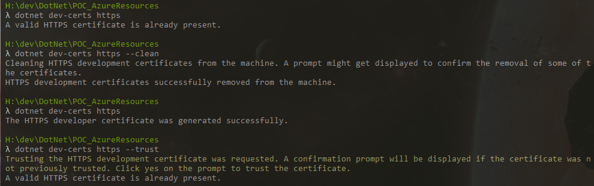

So I am getting into dotnet a little bit, primarily playing around with Blazor. I noticed that, despite following the certificate instructions when regenerating the project template, I was still getting HTTPS errors on localhost (it was just the standard 'the certificate appears invalid, are you sure you want to proceed?').

In my case, running on Windows, what I did was the following:

- Open CMD
- Run `dotnet dev-certs https` and verify that a certificate does indeed exist
- Run `dotnet dev-certs https --clean` and click the prompt to remove the certificate
- Run `dotnet dev-certs https` to generate a new certificate
- Run `dotnet dev-certs https --trust` and click the prompt to add the certificate to the root CA
- Check that your app works

A screenshot of the process can be found below:

