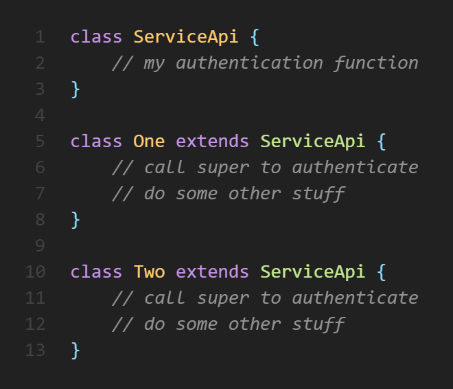
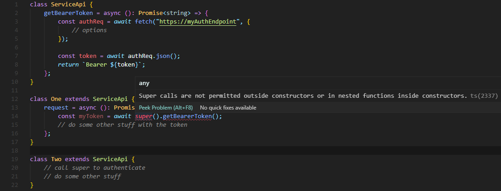
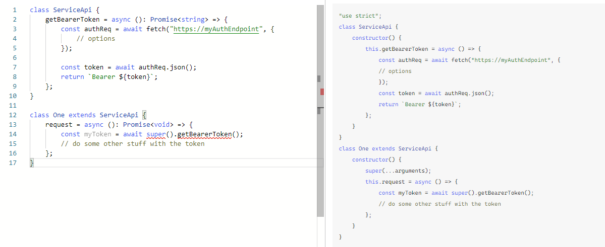
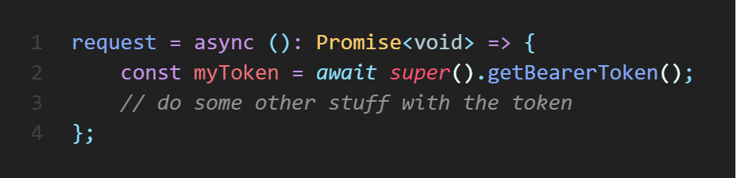
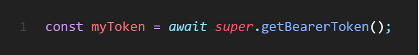

So, here's the thing, I'd never used classes in JavaScript before. What I was creating was an API service which has an authentication request function, then two classes hanging off of this because the same authentication endpoint was used, but everything else was different.

Simple, yeah? Where did it all fall apart for me? Well, what I was originally trying to do was something alone these lines:

What do I do about this? Naturally, not really read the error and proceed to try nearly every single permutation to call any kind of function in JavaScript, but nothing worked. I was almost convinced that this was a TypeScript transpilation issue, but I was still left with the same *"Super calls are not permitted outside constructors or in nested functions inside constructors"* error.

Off to [TypeScript Playground](https://www.typescriptlang.org/play) to see what's going on, then:

Alrighty, so I get the same error as before, cool. The code is being transpiled, the function is correctly being bound and looks valid, great. So what's the problem? Let's take another look at the error and break it down:

***Super calls are not permitted outside constructors or in nested functions inside constructors***

Super calls are not permitted outside constructors. Super.. *calls*? Hold on, what? Then I looked at what I had written:

Super(). Oops. I just wanted a reference to the function in the parent class, not call its constructor. Simply removing the parentheses made everything happy again:

The lessons?

Obviously, well, read the error first. Perhaps more importantly for me, though, was to use the [TypeScript Playground](https://www.typescriptlang.org/play). While I knew it existed, I'd never really used it much before. I had honestly believed that the problem was with TypeScript for one reason or another, and the playground let me get past that to see what the error really was. I regularly use it now and have honestly learned a lot from seeing the 'raw' JavaScript side by side.